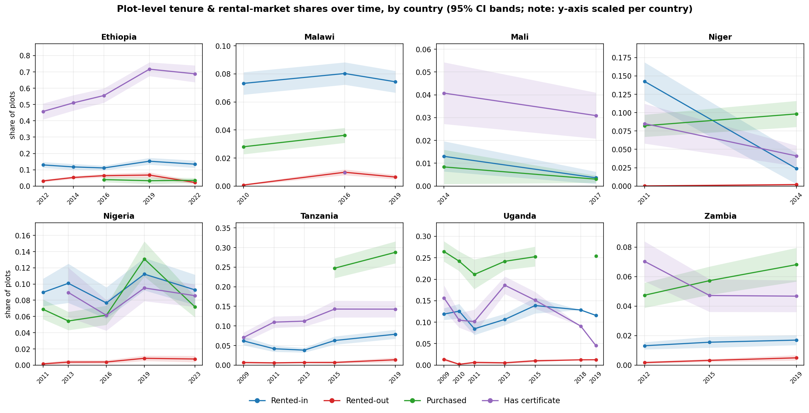
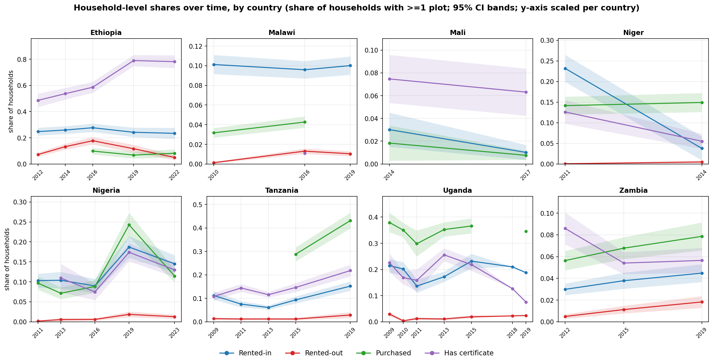

<!-- This document is assembled by Report/assemble_report.py from the live project
     outputs. Tables, the figure, and the provenance appendix are auto-generated. All edits should be done to THIS markdown file directly and re-render with
     build_report.sh (DO NOT re-run assemble_report.py, which overwrites prose). -->

# 1. Overview

This document present summary statistics on rural land rental market participation (and related variables) derived from nationally representative rural household survey datasets, primarily taken from the World Bank's LSMS-ISA project.  the objective is to make the assembly of these variables completely transparent and reproducible from source files.  at present, all source files used are taken from the LSMS-ISA project, with the exception of the Rural Agricultural Livelihoods Survey (RALS) data for Zambia, which is used by permission from the Indaba Agricultural Research Institute (IAPRI).  The replication code and outputs are provided in the GitHub page where this document is found.  The source files need to be downloaded (using links to LSMS-ISA data provided in section 7; RALS data may be accessed through permission from IAPRI) and made available to scripts to enable the workflow to run on a users computer.

# 2. Coverage

At present, eight nationally representative farm-household surveys across Sub-Saharan Africa, seven from the World Bank LSMS-ISA program and one (Zambia RALS) from IAPRI-MSU.

**Table 1. Survey coverage** - countries, source surveys, survey years, and the spatial unit. The reporting unit is the *parcel*: in some surveys it is subdivided into fields/plots, in others it is a single land unit.

| Country | Survey (source) | Survey years | Spatial unit (reporting unit) |
|---|---|---|---|
| Ethiopia | ESS (LSMS-ISA) | 2012, 2014, 2016, 2019, 2022 | parcel (subdivided into fields) |
| Malawi | IHS cross-sections (LSMS-ISA) | 2010, 2016, 2019 | plot (2010); garden subdivided into plots (2016, 2019) |
| Mali | EACI (LSMS-ISA) | 2014, 2017 | parcelle (single land unit) |
| Niger | ECVMA (LSMS-ISA) | 2011, 2014 | parcelle (single land unit) |
| Nigeria | GHS-Panel (LSMS-ISA) | 2011, 2013, 2016, 2019, 2023 | plot (single land unit) |
| Tanzania | NPS (LSMS-ISA) | 2009, 2011, 2013, 2015, 2019 | plot (single land unit) |
| Uganda | UNPS (LSMS-ISA) | 2009, 2010, 2011, 2013, 2015, 2018, 2019 | parcel (subdivided into plots); season 1 reported |
| Zambia | RALS (IAPRI-MSU) | 2012, 2015, 2019 | field (single land unit) |
| Tanzania (ASC) | Agric. Sample Census (NBS) | 2009, 2019 | household (land by tenure category) |

# 3. Definitions and methods

The unit of analysis is the the tenure-bearing land unit in each
survey; this is the *field* in single-level surveys and the *parcel* above
fields/plots in Ethiopia, Uganda and Malawi. For convenience, we refer to all of these units assembed for the pooled analysis as *parcels*. 

For every parcel we record:

**Table 2. Output variables** - the variables constructed for each unit.

| Output variable | Definition | Type |
|---|---|---|
| `parcel_rentedin` | Parcel rented or sharecropped IN | 0/1 |
| `parcel_rentedout` | Parcel rented or sharecropped OUT | 0/1 |
| `parcel_certificate` | Parcel has a land certificate / document | 0/1 |
| `parcel_purchased` | Parcel acquired through purchase | 0/1 (`.` if not asked) |
| `parcel_area_ha` | Cultivated parcel area (Σ field GPS, else self-reported) | hectares |
| `n_fields` | Number of cultivated fields on the parcel | count |
| `season` | Cropping season (1 = single-season country / Uganda season 1; 2 = Uganda season 2) | 1/2 |
| `weight` | Household survey weight | analytic/probability |
| `ea_id` | Enumeration area (survey PSU) | id |
| `strataid` | Survey design stratum | id |
| `country` `wave` `year` `hh_id` `holder_id` `parcel_id` | Identifiers | — |

**Area cleaning.** `parcel_area_ha` is **top-coded**: values above `${area_max}` (40 ha,
set in `MASTER.do`) are treated as data-entry errors and set missing. Smallholder
parcels rarely exceed this, but the raw self-reported areas carry unit-entry outliers
(e.g. tens of thousands of "acres") that otherwise inflate the *mean* (the median is
unaffected). This matters most where a parcel falls back to self-reported area because
GPS is missing; GPS-measured areas are well-behaved.

---

**Weighting and inference.** All shares are survey-weighted using each round's 
household weight, with the survey design set as `svyset psu [pw=weight],
strata(strata)` where the PSU and stratum are made unique by country x wave;
single-PSU strata are centered. Confidence intervals are design-based (Taylor
linearization). Tables report season 1 (the only season for all countries except
Uganda, which is computed for both and reported for season 1).

Please note that the pooled data draws on survey rounds, some of which are panel data (repeated visits to the same households) and new cross-sectional survey rounds (where households are not repeated from prior rounds). The statistics reported here are repeated cross-sectional, design-weighted prevalence estimates rather than panel or transition estimates. For each survey round we apply that round's official household weight, which the data producers construct to make the round representative of its target population and which already incorporates their own unit non-response and, for the panel surveys, attrition adjustments. Because each estimate targets the population at the time of that round rather than a fixed cohort followed across waves, between-wave attrition does not bias a given year's share. 

As noted above, several of the surveys are independent cross-sections rather than panels - Mali's EACI and Niger's ECVMA each draw fresh samples - so a common attrition correction would be neither feasible nor meaningful across the eight surveys. We therefore read the over-time figures as a sequence of representative snapshots rather than as within-household trajectories. The lone exception is Zambia's 2019 RALS round, for which only a panel weight is released; that estimate represents the followed panel, and is noted as such.

# 4. Interpretion guidance

## Missing by design (read this before interpreting the tables)

Some variables are **missing (`.`) for entire country-years**. These are
**structural** missings: the survey simply did not ask the relevant question that
round, so the concept is *unmeasured*, not zero and not item non-response. A `.`
here means "not collected this wave," and these country-years must be **excluded**
(not treated as 0) when computing rates or trends. This is why the QC estimates one
variable at a time - a joint `mean`/`svy: mean` would casewise-drop these whole
country-years from the *other* variables too.

**Table 3. Structurally missing variables** - items not collected in particular country-years.

| Country | Variable | Missing year(s) | Why |
|---------|--------------------|-----------------|--------------------------------------------------|
| Ethiopia | `parcel_purchased` | 2012, 2014 | ESS11/ESS13 acquisition question had **no "purchased" category**; "Purchased" (code 7) is first offered in wave 3 (2016). |
| Malawi | `parcel_certificate` | 2010 | IHS3 (2010) has **no title/ownership-document question** for the plot. |
| Malawi | `parcel_certificate` | 2019 | The 2019 round **dropped** the title/document question. |
| Malawi | `parcel_purchased` | 2019 | The 2019 round **dropped the categorical "how acquired" question** entirely (only "from whom" and "year acquired" remain), so acquisition mode - including purchase - is not identifiable. |
| Mali | `parcel_rentedout` | 2014, 2017 | EACI surveys only the parcels a household **operates**, so land rented/lent **out** is out of frame (no rented-out code in 2014; the 2017 "Louee/Pretee" code flags only 5 of ~24,250 parcels). |
| Nigeria | `parcel_certificate` | 2011 | GHS wave 1 has **no certificate-of-occupancy question** in the tenure module (added from wave 2). |
| Tanzania | `parcel_purchased` | 2009, 2011, 2013 | The early NPS "ownership status" question has **no acquisition-mode / purchase category** (added when the question was redesigned to "how was this plot acquired?" in NPS4, 2015). |
| Uganda | `parcel_purchased` | 2018 | UNPS7 (2018/19) fielded a **reduced panel re-interview** roster for owned parcels: the acquisition item `s2aq8` was **not administered** (0 of 4,368 parcels), so acquisition mode - including purchase - is unidentifiable. (Area and tenure-system were also only re-collected for the ~25% of parcels that were new or re-measured; see Uganda §6.) |

All other variables are populated in every country-year shown. (Within a populated
country-year, ordinary item non-response is handled the usual way - e.g. a parcel
with no usable area is missing on `parcel_area_ha` only.)

---

## Rented-in: sharecropping coverage (read before comparing rented-in levels)

`parcel_rentedin` is meant to capture access to land for a payment, which in principle
includes **sharecropping** (a share-of-output payment) as well as fixed cash/kind rental.
Surveys differ in whether sharecropping is recorded *separately*, so coverage varies:

**Table 4. Sharecropping coverage in `rented_in`**, by survey.

| Country | Sharecropping in `rented_in`? | Basis |
|---------|-------------------------------|-------|
| Ethiopia | **Yes** | acquisition has both a "rent" and a separate "sharecrop" code |
| Mali | **Yes** | occupation mode includes *metayage* (sharecropping) |
| Tanzania | **Yes** | tenure has "rented in" plus a separate "shared-rent" (sharecrop) code |
| Zambia | **Yes** | field land-use "rented in" is defined as *cash or in-kind* |
| Malawi | Partial / unclear | "leasehold / rented / tenant" categories; no explicit sharecrop code |
| Nigeria | Cash rental | "rented" acquisition code; sharecropping not separately identified |
| Uganda | Cash rental (likely undercounts sharecrop) | rented-in keyed on rent *paid > 0*; in-kind shares may not register |
| Niger | **No sharecropping at all** | "location" (cash rental) only; the survey has no sharecropping category |

Where sharecropping is not separately coded (Niger entirely; Nigeria/Malawi/Uganda weakly),
the cross-country rented-in levels are **lower bounds** on total rental-market participation.
(Flagged for the questionnaire review.)

---

**Two further round-specific caveats.** Uganda's 2018 (UNPS7) round used a reduced
panel re-interview: the owned-parcel acquisition item was not administered (so
purchase is missing that round) and area/tenure were re-collected for only ~25% of
parcels. Zambia's 2019 (RALS) release carries only a panel weight (no
cross-sectional weight), so the 2019 endpoint represents the followed panel, not a
fresh cross-section.

# 5. Results

Survey-weighted shares by country and survey year (season 1). A dash (`-`) marks
structurally missing items (question not asked that round; see Section 4).

Tanzania appears twice: the LSMS-ISA panel ("Tanzania (LSMS)") and, listed separately,
the Tanzania Agricultural Sample Census ("Tanzania (ASC)"). The ASC records land by
tenure category at the household level rather than by plot, so it appears only in the
household-share and area-share tables (Tables 5 and 7) and is excluded from the
plot-share table (Table 6) and the trend figures.

## 5.1 Share of households (with one or more plots rented, etc.)

**Table 5.** Share of households with at least one plot that is rented-in, rented-out, purchased, or holds a land certificate, by country and survey year (season 1; survey-weighted). A dash (`-`) denotes an item not collected that round.

| Country | Year | Rented-in | Rented-out | Purchased | Has certificate |
|---|---|---|---|---|---|
| Ethiopia (LSMS) | 2012 | 0.248 | 0.073 | - | 0.486 |
|    | 2014 | 0.259 | 0.132 | - | 0.537 |
|    | 2016 | 0.277 | 0.178 | 0.099 | 0.586 |
|    | 2019 | 0.242 | 0.117 | 0.068 | 0.790 |
|    | 2022 | 0.234 | 0.050 | 0.082 | 0.782 |
| Malawi (LSMS) | 2010 | 0.101 | 0.001 | 0.032 | - |
|    | 2016 | 0.096 | 0.013 | 0.043 | 0.011 |
|    | 2019 | 0.100 | 0.010 | - | - |
| Mali (LSMS) | 2014 | 0.030 | - | 0.018 | 0.075 |
|    | 2017 | 0.010 | - | 0.008 | 0.063 |
| Niger (LSMS) | 2011 | 0.232 | 0.001 | 0.141 | 0.126 |
|    | 2014 | 0.038 | 0.005 | 0.149 | 0.055 |
| Nigeria (LSMS) | 2011 | 0.103 | 0.002 | 0.097 | - |
|    | 2013 | 0.104 | 0.006 | 0.071 | 0.109 |
|    | 2016 | 0.090 | 0.006 | 0.088 | 0.075 |
|    | 2019 | 0.187 | 0.019 | 0.243 | 0.174 |
|    | 2023 | 0.145 | 0.013 | 0.115 | 0.130 |
| Tanzania (LSMS) | 2009 | 0.112 | 0.013 | - | 0.108 |
|    | 2011 | 0.075 | 0.012 | - | 0.144 |
|    | 2013 | 0.061 | 0.012 | - | 0.116 |
|    | 2015 | 0.093 | 0.012 | 0.288 | 0.146 |
|    | 2019 | 0.152 | 0.029 | 0.432 | 0.218 |
| Tanzania (ASC) | 2009 | 0.108 | 0.028 | 0.195 | 0.061 |
|    | 2019 | 0.201 | 0.029 | 0.077 | 0.077 |
| Uganda (LSMS) | 2009 | 0.214 | 0.030 | 0.379 | 0.226 |
|    | 2010 | 0.202 | 0.004 | 0.350 | 0.168 |
|    | 2011 | 0.136 | 0.012 | 0.298 | 0.159 |
|    | 2013 | 0.172 | 0.011 | 0.352 | 0.256 |
|    | 2015 | 0.232 | 0.019 | 0.366 | 0.218 |
|    | 2018 | 0.210 | 0.023 | - | 0.127 |
|    | 2019 | 0.188 | 0.024 | 0.346 | 0.075 |
| Zambia (RALS) | 2012 | 0.030 | 0.005 | 0.056 | 0.086 |
|    | 2015 | 0.038 | 0.011 | 0.068 | 0.054 |
|    | 2019 | 0.045 | 0.018 | 0.079 | 0.056 |

## 5.2 Share of plots

**Table 6.** Share of plots that are rented-in, rented-out, purchased, or hold a land certificate, by country and survey year (season 1; survey-weighted). A dash (`-`) denotes an item not collected that round.

| Country | Year | Rented-in | Rented-out | Purchased | Has certificate |
|---|---|---|---|---|---|
| Ethiopia (LSMS) | 2012 | 0.130 | 0.032 | - | 0.458 |
|    | 2014 | 0.117 | 0.053 | - | 0.510 |
|    | 2016 | 0.111 | 0.064 | 0.040 | 0.555 |
|    | 2019 | 0.152 | 0.068 | 0.033 | 0.717 |
|    | 2022 | 0.134 | 0.022 | 0.035 | 0.688 |
| Malawi (LSMS) | 2010 | 0.073 | 0.001 | 0.028 | - |
|    | 2016 | 0.080 | 0.010 | 0.036 | 0.010 |
|    | 2019 | 0.074 | 0.006 | - | - |
| Mali (LSMS) | 2014 | 0.013 | - | 0.008 | 0.041 |
|    | 2017 | 0.004 | - | 0.003 | 0.031 |
| Niger (LSMS) | 2011 | 0.143 | 0.000 | 0.082 | 0.085 |
|    | 2014 | 0.024 | 0.002 | 0.098 | 0.041 |
| Nigeria (LSMS) | 2011 | 0.090 | 0.002 | 0.069 | - |
|    | 2013 | 0.101 | 0.004 | 0.054 | 0.090 |
|    | 2016 | 0.077 | 0.004 | 0.062 | 0.061 |
|    | 2019 | 0.112 | 0.008 | 0.131 | 0.095 |
|    | 2023 | 0.093 | 0.008 | 0.072 | 0.086 |
| Tanzania (LSMS) | 2009 | 0.062 | 0.007 | - | 0.070 |
|    | 2011 | 0.042 | 0.006 | - | 0.110 |
|    | 2013 | 0.038 | 0.007 | - | 0.112 |
|    | 2015 | 0.063 | 0.007 | 0.247 | 0.143 |
|    | 2019 | 0.079 | 0.014 | 0.288 | 0.143 |
| Uganda (LSMS) | 2009 | 0.119 | 0.013 | 0.265 | 0.157 |
|    | 2010 | 0.126 | 0.002 | 0.242 | 0.105 |
|    | 2011 | 0.085 | 0.006 | 0.211 | 0.101 |
|    | 2013 | 0.106 | 0.005 | 0.242 | 0.186 |
|    | 2015 | 0.139 | 0.010 | 0.253 | 0.151 |
|    | 2018 | 0.128 | 0.012 | - | 0.091 |
|    | 2019 | 0.116 | 0.013 | 0.254 | 0.045 |
| Zambia (RALS) | 2012 | 0.013 | 0.002 | 0.047 | 0.070 |
|    | 2015 | 0.016 | 0.003 | 0.057 | 0.047 |
|    | 2019 | 0.017 | 0.005 | 0.068 | 0.047 |

## 5.3 Share of farm area (hectares)

**Table 7.** Share of farm area (hectares) that is rented-in, rented-out, purchased, or holds a land certificate, by country and survey year (season 1; survey-weighted). A dash (`-`) denotes an item not collected that round; for rented-out it can also denote that the rented-out parcels carry no measured area (they are uncultivated, so no field area is recorded - e.g. Ethiopia 2019, 2022), making the area share undefined rather than zero.

| Country | Year | Rented-in | Rented-out | Purchased | Has certificate |
|---|---|---|---|---|---|
| Ethiopia (LSMS) | 2012 | 0.100 | 0.013 | - | 0.560 |
|    | 2014 | 0.127 | 0.049 | - | 0.517 |
|    | 2016 | 0.132 | 0.046 | 0.034 | 0.556 |
|    | 2019 | 0.186 | - | 0.018 | 0.731 |
|    | 2022 | 0.192 | - | 0.027 | 0.740 |
| Malawi (LSMS) | 2010 | 0.072 | 0.001 | 0.037 | - |
|    | 2016 | 0.077 | 0.010 | 0.048 | 0.022 |
|    | 2019 | 0.073 | 0.005 | - | - |
| Mali (LSMS) | 2014 | 0.006 | - | 0.006 | 0.045 |
|    | 2017 | 0.002 | - | 0.003 | 0.020 |
| Niger (LSMS) | 2011 | 0.103 | 0.000 | 0.076 | 0.087 |
|    | 2014 | 0.022 | 0.002 | 0.094 | 0.045 |
| Nigeria (LSMS) | 2011 | 0.105 | 0.001 | 0.088 | - |
|    | 2013 | 0.164 | 0.003 | 0.054 | 0.069 |
|    | 2016 | 0.068 | 0.006 | 0.069 | 0.061 |
|    | 2019 | 0.127 | 0.015 | 0.126 | 0.108 |
|    | 2023 | 0.093 | 0.010 | 0.089 | 0.108 |
| Tanzania (LSMS) | 2009 | 0.039 | 0.007 | - | 0.070 |
|    | 2011 | 0.026 | 0.012 | - | 0.124 |
|    | 2013 | 0.026 | 0.019 | - | 0.152 |
|    | 2015 | 0.058 | 0.011 | 0.397 | 0.183 |
|    | 2019 | 0.051 | 0.030 | 0.432 | 0.181 |
| Tanzania (ASC) | 2009 | 0.045 | 0.016 | 0.156 | 0.055 |
|    | 2019 | 0.085 | 0.020 | 0.060 | 0.059 |
| Uganda (LSMS) | 2009 | 0.062 | 0.022 | 0.259 | 0.242 |
|    | 2010 | 0.066 | 0.004 | 0.237 | 0.162 |
|    | 2011 | 0.048 | 0.017 | 0.246 | 0.152 |
|    | 2013 | 0.075 | 0.008 | 0.286 | 0.239 |
|    | 2015 | 0.094 | 0.008 | 0.296 | 0.224 |
|    | 2018 | 0.134 | 0.003 | - | 0.125 |
|    | 2019 | 0.082 | 0.011 | 0.272 | 0.046 |
| Zambia (RALS) | 2012 | 0.011 | 0.003 | 0.063 | 0.083 |
|    | 2015 | 0.013 | 0.004 | 0.084 | 0.066 |
|    | 2019 | 0.013 | 0.006 | 0.083 | 0.062 |

We observe different participation rates for the different countries, with the highest rates in Ethiopia (23-27% of households renting in) and Uganda (14-22% of households renting in) and the lowest rates in Zambia (<4% of households renting in) and Mali (<2% of households renting in). This conforms somewhat to rural population densities, although some high population density countries have only moderate rates of rental (e.g., Malawi, where household rates of renting in land are around 10% for the included waves).

The rates of renting in are systematically higher than rates of renting out. This difference is observed for all countries in all waves, although the ratio of renting in to renting out rates varies considerably, with household rates of renting in exceeding household rates of renting out by as little as 56% (in Ethiopia for 2016) to more than 1000% (most waves in Uganda, Nigeria; the first wave of Malawi; the first wave of Niger). This speaks to systematic distortions in the probability of reporting renting in versus renting out land. Note that in Mali, data on renting out land is not collected at all. 

Household rental participation rates (defined as the share of households in the sample which are renting one or more parcels) are systematically higher than parcel-level statistics, as expected. The magnitude of this difference (which is reflective, in part, of the average number of plots per farm) is lowest in Nigeria (where household rates exceed plot-level rental participation rates by <20%) and highest in Ethiopia and Zambia (where household rental participation rates are often >100% greater than plot-level rental participation rates).

Note that in some countries, the wave-on-wave differences in rental rates is quite high, which may reflect suvey differences more than actual changes in rental market participation.  Mali is a good example of this, where rent-to-market participation rates at both the household and plot level are three times higher in the first wave than the second wave.  the second wave was a much broader sampling frame than the first wave, however, which means that these averages are reflective of different areas and shouldn't be interpreted as changes over time in the same population 

# 6. Trends over time

Figures 1 and 2 present these shares over time at the plot and household levels, respectively. With the caveat that waves are not strictly comparable (due to instrument changes, panel attrition, and the sample redesign breaks flagged in Section 4 and the appendix), we may compare levels across time to see if any strong patterns are detectable. For the most part, the patterns are too noisy to ascribe much of a unified story to. Rented land is only increasing consistently over the period observed in Zambia, although at very low base levels. Tanzania shows growth between the first and last waves observed, but not consistently across intervening waves. Ethiopia and Malawi are essentially flat. Altogether, there is not much of a consistent growth story observable in these data. 

# 7. Data sources and reproduction

The repository contains **no microdata**. LSMS-ISA surveys are obtained (free,
with registration) from the World Bank Microdata Library; Zambia RALS is obtained
from IAPRI. After placing the raw files in the expected folder tree, running
`Code/MASTER.do` rebuilds the pooled dataset and `Code/tables_graphs.do` (or
`Code/tables_graphs.py`) regenerates every table and figure here. Full per-survey
file lists are in `DATA_SOURCES.md`.

All code, reference documentation, and the outputs reproduced here are available in
the project's public GitHub repository, <https://github.com/chamb244/ssa-land-rental>.
The repository contains the country-by-country extractors, the pooled-dataset build
(`MASTER.do`), the table and figure generators, this report and its build script, and
the full variable-provenance reference. Code is released under the MIT License and the
accompanying documentation under CC-BY-4.0; the survey microdata themselves are not
redistributed and must be obtained from the providers below.

## Main source file and catalog link, by survey wave

The table gives, for each survey wave, the primary land/tenure roster file the workflow
reads (the complete per-wave file list is in Appendix A). Catalog links are shown where a
stable URL is available; entries marked _(pending)_ can be located in the World Bank
Microdata Library (LSMS-ISA) or, for Zambia, obtained from IAPRI.

**Table 8. Primary source file and data catalog, by survey wave.**

| Country | Year | Main source file | Data catalog |
|---|---|---|---|
| Ethiopia | 2012 | `sect2_pp_w1.dta` | [ESS 2011/12](https://microdata.worldbank.org/index.php/catalog/2053) |
|  | 2014 | `sect2_pp_w2.dta` | [ESS 2013/14](https://microdata.worldbank.org/index.php/catalog/2247) |
|  | 2016 | `sect2_pp_w3.dta` | [ESS 2015/16](https://microdata.worldbank.org/index.php/catalog/2783) |
|  | 2019 | `sect2_pp_w4.dta` | [ESS 2018/19](https://microdata.worldbank.org/index.php/catalog/3823) |
|  | 2022 | `sect2_pp_w5.dta` | [ESS 2021/22](https://microdata.worldbank.org/index.php/catalog/6161) |
| Malawi | 2010 | `ag_mod_d.dta` (IHS3 Full_Sample) | [IHS3 2010/11](https://microdata.worldbank.org/index.php/catalog/1003) |
|  | 2016 | `ag_mod_b2.dta` (IHS4) | [IHS4 2016/17](https://microdata.worldbank.org/index.php/catalog/2936) |
|  | 2019 | `ag_mod_b2.dta` (IHS5) | [IHS5 2019/20](https://microdata.worldbank.org/index.php/catalog/3818) |
| Mali | 2014 | `EACIEXPLOI_p1.dta` | [EACI 2014](https://microdata.worldbank.org/index.php/catalog/2583) |
|  | 2017 | `eaci17_s11bp1.dta` | [EACI 2017](https://microdata.worldbank.org/index.php/catalog/3409) |
| Niger | 2011 | `ecvmaas1_p1.dta` | [ECVMA 2011](https://microdata.worldbank.org/index.php/catalog/2050) |
|  | 2014 | `ECVMA2_AS1P1.dta` | [ECVMA 2014](https://microdata.worldbank.org/index.php/catalog/2676) |
| Nigeria | 2011 | `sect11b_plantingw1.dta` | [GHS 2010/11](https://microdata.worldbank.org/index.php/catalog/1002) |
|  | 2013 | `sect11b1_plantingw2.dta` | [GHS 2012/13](https://microdata.worldbank.org/index.php/catalog/1952) |
|  | 2016 | `sect11b1_plantingw3.dta` | [GHS 2015/16](https://microdata.worldbank.org/index.php/catalog/2734) |
|  | 2019 | `sect11b1_plantingw4.dta` | [GHS 2018/19](https://microdata.worldbank.org/index.php/catalog/3557) |
|  | 2023 | `sect11b1_plantingw5.dta` | [GHS-Panel 2023 (W5)](https://microdata.worldbank.org/index.php/catalog/6410) |
| Tanzania (LSMS) | 2009 | `SEC_3A.dta` | [NPS 2008/09](https://microdata.worldbank.org/index.php/catalog/76) |
|  | 2011 | `AG_SEC3A.dta` | [NPS 2010/11](https://microdata.worldbank.org/index.php/catalog/1050) |
|  | 2013 | `AG_SEC_3A.dta` | [NPS 2012/13](https://microdata.worldbank.org/index.php/catalog/2252) |
|  | 2015 | `AG_SEC_3A.dta` (extended + refresh) | [NPS 2014/15](https://microdata.worldbank.org/index.php/catalog/2862) |
|  | 2019 | `AG_SEC_3A.dta` (extended + refresh) | [NPS 2019/20 SDD](https://microdata.worldbank.org/index.php/catalog/3885) |
| Tanzania (ASC) | 2009 | `R041.DTA` (smallholder) | [ASC 2008/09 (NBS)](https://microdata.nbs.go.tz/index.php/catalog/5) |
|  | 2019 | `R041_LAND_OWNERSHIP.dta` | [ASC 2019/20 (NBS)](https://microdata.nbs.go.tz/index.php/catalog/31) |
| Uganda | 2009 | `2009_AGSEC2A.dta` | [UNPS 2009/10](https://microdata.worldbank.org/index.php/catalog/1001) |
|  | 2010 | `AGSEC2A.dta` | [UNPS 2010/11](https://microdata.worldbank.org/index.php/catalog/2166) |
|  | 2011 | `AGSEC2A.dta` | [UNPS 2011/12](https://microdata.worldbank.org/index.php/catalog/2059) |
|  | 2013 | `AGSEC2A.dta` | [UNPS 2013/14](https://microdata.worldbank.org/index.php/catalog/2663) |
|  | 2015 | `AGSEC2A.dta` | [UNPS 2015/16](https://microdata.worldbank.org/index.php/catalog/3460) |
|  | 2018 | `AGSEC2A.dta` | [UNPS 2018/19](https://microdata.worldbank.org/index.php/catalog/3795) |
|  | 2019 | `agsec2a.dta` | [UNPS 2019/20](https://microdata.worldbank.org/index.php/catalog/3902) |
| Zambia | 2012 | `field.dta` | [RALS 2012 (IHSN)](https://catalog.ihsn.org/catalog/7201) |
|  | 2015 | `field.dta` | [RALS 2015 (IHSN)](https://catalog.ihsn.org/catalog/7200) |
|  | 2019 | `field.dta` | request from IAPRI (info@iapri.org.zm) |

# Appendix A. Per-country variable provenance

For every final variable, the exact source file, source variable(s), value-label
codes and construction rule, by country and wave (verified against the raw data).

## ETHIOPIA — Ethiopia Socioeconomic Survey (ESS)

### 1. Survey & wave key

| Wave | Round | Year (assigned) | Parcel roster | Field roster | HH cover | HH id |
|------|--------|--------|----------------|----------------|----------------|------------|
| 1 | ESS 11 | 2012 | `sect2_pp_w1.dta` | `sect3_pp_w1.dta` | `sect_cover_hh_w1.dta` | `household_id` |
| 2 | ESS 13 | 2014 | `sect2_pp_w2.dta` | `sect3_pp_w2.dta` | `sect_cover_hh_w2.dta` | `household_id2` |
| 3 | ESS 15 | 2016 | `sect2_pp_w3.dta` | `sect3_pp_w3.dta` | `sect_cover_hh_w3.dta` | `household_id2` |
| 4 | ESS 18 | 2019 | `sect2_pp_w4.dta` | `sect3_pp_w4.dta` | `sect_cover_hh_w4.dta` | `household_id` |
| 5 | ESS 21 | 2022 | `sect2_pp_w5.dta` | `sect3_pp_w5.dta` | `sect_cover_hh_w5.dta` | `household_id` |

Land-unit conversion file (for self-reported area): `ET_local_area_unit_conversion.dta`,
present in ESS 11/13/15/18; **wave 5 reuses the ESS 18 copy** (none ships with ESS 21).

### 2. Tenure indicators

All four are built on the **parcel roster** (`sect2_pp_w*.dta`); key = `holder_id parcel_id`.
"Acquisition" = the parcel-acquisition question; its value labels are in §5.

| Variable | Wave | Source file | Source var | Construction |
|------------------|------|----------------|--------------|--------------------------------|
| `parcel_rentedin` | 1 | `sect2_pp_w1.dta` | `pp_s2q03` | `inlist(pp_s2q03,3)` — Rent |
| `parcel_rentedin` | 2 | `sect2_pp_w2.dta` | `pp_s2q03` | `inlist(pp_s2q03,3)` — Rent |
| `parcel_rentedin` | 3 | `sect2_pp_w3.dta` | `pp_s2q03` | `inlist(pp_s2q03,3,6)` — Rent + Sharecrop-in |
| `parcel_rentedin` | 4 | `sect2_pp_w4.dta` | `s2q05` | `inlist(s2q05,3,6)` — Rent + Sharecrop-in |
| `parcel_rentedin` | 5 | `sect2_pp_w5.dta` | `s2q05` | `inlist(s2q05,3,6)` — Rent + Sharecrop-in |
| `parcel_rentedout` | 1 | `sect2_pp_w1.dta` | `pp_s2q10` | `pp_s2q10==1` — any fields rented out (Yes/No) |
| `parcel_rentedout` | 2 | `sect2_pp_w2.dta` | `pp_s2q10` | `pp_s2q10==1` |
| `parcel_rentedout` | 3 | `sect2_pp_w3.dta` | `pp_s2q10` | `pp_s2q10==1` |
| `parcel_rentedout` | 4 | `sect2_pp_w4.dta` | `s2q13` | `inlist(s2q13,1,2)` — all rented out / all sharecropped out |
| `parcel_rentedout` | 5 | `sect2_pp_w5.dta` | `s2q13` | `inlist(s2q13,1,2)` — all rented out / all sharecropped out |
| `parcel_certificate` | 1 | `sect2_pp_w1.dta` | `pp_s2q04` (+`pp_s2q03`) | `pp_s2q04`: 1→1, 2→0; then 0 if `pp_s2q03∈{3,4,6}` |
| `parcel_certificate` | 2 | `sect2_pp_w2.dta` | `pp_s2q04` (+`pp_s2q03`) | `pp_s2q04`: 1→1, 2→0; then 0 if `pp_s2q03∈{3,4,6}` |
| `parcel_certificate` | 3 | `sect2_pp_w3.dta` | `pp_s2q04` (+`pp_s2q03`) | `pp_s2q04`: 1→1, 2→0; then 0 if `pp_s2q03∈{3,4,6}` |
| `parcel_certificate` | 4 | `sect2_pp_w4.dta` | `s2q03` | `s2q03`: 1→1, 2→0 (document) |
| `parcel_certificate` | 5 | `sect2_pp_w5.dta` | `s2q03` | `s2q03`: 1→1, 2→0 (document) |
| `parcel_purchased` | 1 | `sect2_pp_w1.dta` | `pp_s2q03` | **missing** — no purchase category asked |
| `parcel_purchased` | 2 | `sect2_pp_w2.dta` | `pp_s2q03` | **missing** — no purchase category asked |
| `parcel_purchased` | 3 | `sect2_pp_w3.dta` | `pp_s2q03` | `pp_s2q03==7` — Purchased |
| `parcel_purchased` | 4 | `sect2_pp_w4.dta` | `s2q05` | `s2q05==7` — Purchased |
| `parcel_purchased` | 5 | `sect2_pp_w5.dta` | `s2q05` | `s2q05==7` — Purchased |

### 3. Parcel area (`parcel_area_ha`)

Built on the **field roster** (`sect3_pp_w*.dta`) at field level, then summed to the
parcel (`collapse (sum) … by(holder_id parcel_id)`). Field area = **GPS where
measured, else self-reported** (both in ha); no model-based imputation, so the measure
is deterministic and reproducible across languages. `n_fields` = count of fields with a
non-missing area. Parcels with no cultivated field (e.g. fully rented out) have missing
area and `n_fields==0`.

| Component | Wave | Source file | Source var(s) | Notes |
|------------------|------|----------------|----------------|----------------------------|
| GPS area (primary) | 1 | `sect3_pp_w1.dta` | `pp_s3q05_a` | × 0.0001 → ha; keep if > 0 |
| GPS area (primary) | 2 | `sect3_pp_w2.dta` | `pp_s3q05_a` | × 0.0001 → ha |
| GPS area (primary) | 3 | `sect3_pp_w3.dta` | `pp_s3q05_a` | × 0.0001 → ha |
| GPS area (primary) | 4 | `sect3_pp_w4.dta` | `s3q08` (flag `s3q07`) | × 0.0001 if `s3q07==1` |
| GPS area (primary) | 5 | `sect3_pp_w5.dta` | `s3q08` (flag `s3q07`) | × 0.0001 if `s3q07∈{1,2}` |
| Self-reported area (fallback when GPS missing) | 1–3 | `sect3_pp_w*.dta` | `pp_s3q02_a`, unit `pp_s3q02_c` | converted to ha via `ET_local_area_unit_conversion.dta` |
| Self-reported area (fallback when GPS missing) | 4–5 | `sect3_pp_w*.dta` | `s3q02a`, unit `s3q02b` | converted to ha (w5 uses ESS 18 conversion file) |

### 4. Design variables & identifiers

| Variable | Wave | Source file | Source var(s) | Construction |
|----------------|------|----------------|----------------|------------------------------|
| `weight` | 1 | `sect_cover_hh_w1.dta` | `pw` | key `household_id` |
| `weight` | 2 | `sect_cover_hh_w2.dta` | `pw2` | key `household_id2` |
| `weight` | 3 | `sect_cover_hh_w3.dta` | `pw_w3` | key `household_id2` |
| `weight` | 4 | `sect_cover_hh_w4.dta` | `pw_w4` | key `household_id` |
| `weight` | 5 | `sect_cover_hh_w5.dta` | `pw_w5` | key `household_id` |
| `ea_id` (PSU) | 1–5 | `sect2_pp_w*.dta` | `ea_id` | carried raw from parcel roster |
| `strataid` | 1 | `sect_cover_hh_w1.dta` | `rural`, `saq01` | `group(rural region2)`; `region2`: `saq01∈{2,6,12,13,15}`→99 |
| `strataid` | 2 | `sect_cover_hh_w2.dta` (+ w1 strata) | `rural`, `saq01` | chained from w1; new urban (`rural==3`) strata added (+10) |
| `strataid` | 3 | `sect_cover_hh_w3.dta` (+ w2 strata) | `rural`, `saq01` | chained from w2; new HHs = max strata within `saq01×rural` |
| `strataid` | 4 | `sect_cover_hh_w4.dta` | `saq14`, `saq01` | explicit region×rural/urban recode (codes 1–32, 99) |
| `strataid` | 5 | `sect_cover_hh_w5.dta` | `saq14`, `saq01` | explicit region×rural/urban recode (codes 1–32, 99) |
| `holder_id`, `parcel_id` | 1–5 | `sect2_pp_w*.dta` | `holder_id`, `parcel_id` | parcel key (also present on field roster) |
| `hh_id` | 1–5 | parcel roster / cover | `household_id` (w1,4,5) / `household_id2` (w2,3) | renamed `hh_id` |
| `year` | 1–5 | — | — | assigned: 2012/2014/2016/2019/2022 |
| `country` | 1–5 | — | — | assigned `"Ethiopia"` |

### 5. Value labels of key source variables (verified against the raw rosters)

**Parcel acquisition** — `pp_s2q03` (w1–3) / `s2q05` (w4–5), *"How did your household acquire [PARCEL]?"*

| Code | w1 (ESS11) | w2 (ESS13) | w3 (ESS15) | w4 (ESS18) | w5 (ESS21) |
|--------|-----------|-----------|-----------|-----------|-----------|
| 1 | Granted by local leaders | Granted by local leaders | Granted by local leaders | Granted by local leaders | Granted by local leaders |
| 2 | Inherited | Inherited | Inherited | Gift / Inherited | Inherited |
| 3 | **Rent** | **Rent** | **Rent** | **Rent** | **Rent** |
| 4 | Borrowed for free | Borrowed for free | Borrowed for free | Borrowed for free | Borrowed for free |
| 5 | Moved in w/o permission | Moved in w/o permission | Moved in w/o permission | Moved in w/o permission | Moved in w/o permission |
| 6 | Other (specify) | Other (specify) | **Shared crop in** | **Shared crop in** | **Shared crop in** |
| 7 | — | — | **Purchased** | **Purchased** | **Purchased** |
| 8 | — | — | Other (specify) | Other (specify) | Other (specify) |
| 10/11/12 | Moved-in / Other variants | — | — | — | — |

**Rented out** — `pp_s2q10` (w1–3): `1 = Yes` (any fields rented out), `2 = No`.
`s2q13` (w4–5): `1 = all rented out`, `2 = all sharecropped out`, `3 = all given out free`, `4 = No`.

**Certificate / document** — `pp_s2q04` (w1–3, "certificate") / `s2q03` (w4–5, "document"): `1 = Yes`, `2 = No`.

**Rural/urban for strata** — `rural` (w1–3) and `saq14` (w4–5, `1 = rural`, `2 = urban`, small-town categories per round).

### 6. Harmonization decisions & caveats (Ethiopia)

- **Unit = parcel.** The universe is every parcel in the parcel roster, so parcels
  entirely rented/sharecropped out are retained even though they have no cultivated
  fields. (Basing on the field roster zeroed out rented-out in w4–5 — see project notes.)
- **`parcel_purchased` is missing in w1–w2.** ESS11/ESS13 offered no "Purchased"
  acquisition category, so purchase is unmeasured (`.`), not a structural zero.
  *Estimate this variable separately:* a joint `mean`/`svy: mean` with the other
  variables uses casewise deletion and silently drops all of 2012–2014.
- **Rental scope: both cash/fixed rental AND sharecropping are counted - read with
  care across waves.** Rented-in is built from the parcel-acquisition question, where
  "Rent" (code 3) and "Shared crop in" (code 6) are separate categories; we include
  both. But the "shared crop in" category only existed from wave 3 (2016) onward - in
  waves 1-2 (2012, 2014) the questionnaire had no separate sharecropping-in option, so
  those years capture rent only (any sharecropping-in fell under "Other"). This is part
  of why rented-in ticks up from 2014 to 2016.
  Rented-out also includes both, but the explicit split appears only from wave 4 (2019):
  `s2q13` distinguishes "all rented out" (1) vs "all sharecropped out" (2), and we count
  both. In waves 1-3 (2012-2016) rented-out comes from a single yes/no item ("were any
  fields rented out?") that does not separately label sharecropping, so it is captured
  broadly rather than itemized.
  Excluded on both sides: "borrowed for free" (acquisition code 4) and "given out for
  free" (disposal code 3 in 2019/2022) - i.e., free / non-market transfers are not
  counted as renting. And because "Rent" (code 3) is not itself split into cash vs fixed
  in-kind rent, "rented in/out" here means cash-or-fixed rental plus sharecropping, not
  cash-only.
- **Area** is cultivated field area summed to the parcel, using GPS where measured and
  self-reported area as a fallback where GPS is missing. The published pipeline instead
  model-imputes missing GPS (pmm); we use the deterministic GPS-else-self-reported
  measure so area reproduces exactly across Stata/R/Python. Tenure variables are unaffected.
- **ESS21 area** omits the `sect12c` ag-extension self-reported supplement used in the
  full pipeline, because its source merge key is inconsistent (`household_id+field_id`
  vs `holder_id+parcel_id+field_id`). w5 area uses the field-roster GPS-else-self-reported measure.
- **Weights** are taken from the household cover file; design-based estimates use
  `svyset ea_id [pw=weight], strata(strataid)` (PSU/strata interacted with wave when pooling).

---

## MALAWI — Integrated Household Survey (IHS) cross-sections

Source: the nationally-representative **IHS repeated cross-sections** (not the IHPS
panel), three rounds with land data: **IHS3 2010/11** (`IHS3 2010/.../Full_Sample`),
**IHS4 2016/17** (`IHS4 2016/...`), and **IHS5 2019/20** (`IHS5 2019/...`). There is
no IHS round in 2013, so the Malawi series is **2010 / 2016 / 2019**. Each round is an
independent cross-section (no panel attrition) with its own cross-sectional weight
`hh_wgt`; household id = `case_id` throughout.

> **Why the switch from IHPS.** The earlier build used the long-term IHPS panel
> subsample (~102 EAs), which is small and subject to cumulative attrition. The IHS
> cross-sections are full nationally-representative samples (≈9,600-10,400 households
> per round) and give the most representative population figures.

> **Unit note.** The land unit differs by round: in **2010** tenure is asked at the
> **plot** level (`ag_mod_d`), so `parcel` := plot; in **2016/2019** tenure is asked at
> the **garden** level (`ag_mod_b2`) and `parcel` := garden (area summed from its plots).

### 1. Survey & wave key

| Wave | Round | Year | HH id | Tenure module (unit) | Area module |
|------|--------|--------|----------------|--------------------------|----------------------------|
| 1 | IHS3 (Full_Sample) | 2010 | `case_id` | `ag_mod_d` (plot) | `ag_mod_c` |
| 2 | IHS4 | 2016 | `case_id` | `ag_mod_b2` (garden) | `ag_mod_c` + `ag_mod_o2` |
| 3 | IHS5 | 2019 | `case_id` | `ag_mod_b2` (garden, restructured) | `ag_mod_c` + `ag_mod_o2` |

Household cover (weight, `ea_id`, strata): `hh_mod_a_filt.dta`.

### 2. Tenure indicators

| Variable | Wave | Source file | Source var | Construction |
|------------------|------|----------------|--------------|--------------------------------|
| `parcel_rentedin` | 1 (2010) | `ag_mod_d` | `ag_d03` | `inlist(ag_d03,6,7,8)` — leasehold/rent/tenant |
| `parcel_rentedin` | 2 (2016) | `ag_mod_b2` | `ag_b203` | `inlist(ag_b203,6,7,8)` |
| `parcel_rentedin` | 3 (2019) | `ag_mod_b2` | `ag_b209a`, `ag_b208b` | rent **paid** in cash `ag_b209a>0` OR output given as rent `ag_b208b>0` (no acquisition question in 2019) |
| `parcel_rentedout` | 1 (2010) | `ag_mod_d` | `ag_d19a-d` | rent received >0 (cash/in-kind) |
| `parcel_rentedout` | 2 (2016) | `ag_mod_b2` | `ag_b217a` | cash received from renting out >0 |
| `parcel_rentedout` | 3 (2019) | `ag_mod_b2` | `ag_b217a`, `ag_b216a` | cash received `ag_b217a>0` OR output received as rent `!mi(ag_b216a)` |
| `parcel_certificate` | 1 (2010) | — | — | **missing** — not asked |
| `parcel_certificate` | 2 (2016) | `ag_mod_b2` | `ag_b204_1` | `inlist(ag_b204_1,1,2,3)` (lease offer / title deed / lease cert) |
| `parcel_certificate` | 3 (2019) | — | — | **missing** — title question dropped |
| `parcel_purchased` | 1 (2010) | `ag_mod_d` | `ag_d03` | `inlist(ag_d03,4,5)` — purchased w/ or w/o title |
| `parcel_purchased` | 2 (2016) | `ag_mod_b2` | `ag_b203` | `ag_b203==4` — purchased |
| `parcel_purchased` | 3 (2019) | — | — | **missing** — acquisition question dropped |

### 3. Parcel area (`parcel_area_ha`)

Plot roster `ag_mod_c` (+ perennial `ag_mod_o2` for 2016/2019). Plot area =
GPS (`ag_c04c`) where measured, else self-reported (`ag_c04a`, unit `ag_c04b`:
1=acre, 2=ha, 3=m²); acres→ha via ×0.404686. No model-based imputation (the published
pipeline pmm-imputes missing GPS; we use the deterministic GPS-else-self-reported
measure for cross-language reproducibility). Summed to the parcel: garden in 2016/2019;
in 2010 each plot is its own parcel. `n_fields` = plots aggregated per parcel. Mean
parcel area is ≈0.40-0.45 ha across rounds.

### 4. Design variables & identifiers

| Variable | Wave | Source file | Source var(s) | Construction |
|----------------|------|----------------|----------------|------------------------------|
| `weight` | 1-3 | `hh_mod_a_filt` | `hh_wgt` | cross-sectional household weight |
| `ea_id` | 1-3 | `hh_mod_a_filt` | `ea_id` | enumeration area (PSU), where present |
| `strataid` | 1-3 | `hh_mod_a_filt` | `region`, `reside` | `group(region reside)` (region × urban/rural) |
| `parcel_id` | 1 | tenure module | `case_id` + plot no. (`ag_c00`/`ag_d00`) | concatenated |
| `parcel_id` | 2-3 | tenure module | `case_id` + `gardenid` | concatenated |
| `year` | 1-3 | — | — | 2010 / 2016 / 2019 |

### 5. Value labels of key source variables (verified)

**Acquisition** — `ag_d03` (2010) / `ag_b203` (2016): *"How did your household acquire this [plot/garden]?"*

| Code | 2010 (ag_d03) | 2016 (ag_b203) |
|------|---------------|----------------|
| 1 | Granted by local leaders | Granted by local leaders |
| 2 | Inherited | Inherited |
| 3 | Bride price | Bride price |
| 4 | **Purchased (with title)** | **Purchased** |
| 5 | **Purchased (no title)** | — |
| 6 | Leasehold | Leasehold |
| 7 | Rent short-term | Rent short-term |
| 8 | Farming as a tenant | Farming as a tenant |
| 9 | Borrowed for free | Borrowed for free |
| 10 | Moved in w/o permission | Moved in w/o permission |
| 96 | Other | Other |

*(2019 has no acquisition-method question; rent is identified from the rent-paid /
rent-received amount items instead.)*

**Rent (2019, restructured module)** — `ag_b209a` cash paid for use of the garden
(>0 → rented in), `ag_b208b` output given as rent (>0 → sharecropped in), `ag_b217a`
cash received from renting out (>0 → rented out), `ag_b216a` output received as rent
(non-missing → rented out). Rent amounts `ag_d19a-d` (2010) = cash/in-kind received.

**Certificate** — `ag_b204_1` (2016): `1` offer of lease · `2` title deed ·
`3` certificate of lease · `4` no · `96` other. Not collected in 2010 or 2019.

### 6. Harmonization decisions & caveats (Malawi)

- **IHS cross-sections, not the IHPS panel** — switched for representativeness; each
  round is a fresh nationally-representative sample weighted by `hh_wgt`. No 2013 round
  exists in the IHS series, so the Malawi series is 2010/2016/2019.
- **Rental variables were derived here** — constructed from the acquisition question
  (2010/2016 rented-in) and the rent-paid/received amount items (2019 rented-in, and
  rented-out in all rounds).
- **Land unit changes across rounds** — plot (2010) vs garden (2016/2019). Counts and
  mean areas are not strictly unit-comparable across that break.
- **2019 (IHS5) restructured the garden module**: the categorical "how acquired" and the
  title questions were dropped, so `parcel_purchased` and `parcel_certificate` are
  **missing** in 2019, and rented-in is a payment-based measure (cash rent paid / output
  given as rent) rather than an acquisition code.
- **Certificate is collected only in 2016** (the formal-title item); it is missing in
  2010 (not asked) and 2019 (dropped). The 2016 rate is very low (~1%).
- **Rented-in** = leasehold/rent/tenant (codes 6,7,8) in 2010/2016, payment-based in
  2019; "borrowed for free" is excluded as non-market access. The weighted household
  rented-in rate is stable at ≈10% across all three rounds.
- **Rented-out is captured differently by round** (rent received in 2010 vs explicit
  cash/output items in 2016/2019) and is low throughout (~0.1% in 2010, ~1% in
  2016/2019); read levels with caution.
- **Purchase** is measurable in 2010/2016 (~3-4% of households) but not 2019.
- **Strata** = `group(region reside)`; PSU = `ea_id` where present.

---

## MALI — Enquete Agricole de Conjoncture Integree (EACI)

Two separate cross-sectional rounds (not a panel): EACI 2014 and EACI 2017.
The 2017 files use a different naming scheme (`eaci17_sNNpY`) and variable prefix
(`s11b…`) than 2014 (`EACI…_p1`, `s1b…`).

> **Unit note.** Everything we use - tenure, acquisition, disposition, and area -
> sits in the single parcel/exploitation roster, so the `parcel` is that roster
> record and no cross-module merge is needed.

### 1. Survey & wave key

| Wave | Round folder | Year | HH id | Parcel roster |
|------|--------------|--------|---------------------|----------------------|
| 1 | `Mali/EACI 14` | 2014 | `grappe`-`menage` | `EACIEXPLOI_p1.dta` (`s1b…`) |
| 2 | `Mali/EACI 17` | 2017 | `grappe`-`exploitation` | `eaci17_s11bp1.dta` (`s11b…`) |

Weights: 2014 `EACIPOIDS.dta` (`poids_menage`); 2017 `EACI17_ECHANTILLON.dta`
(`poids_leger`, and the official `strate`). Cover (2014 strata): `EACICONTROLE_p1.dta`.

### 2. Tenure indicators

| Variable | Wave | Source var | Construction |
|--------------------|------|----------------|----------------------------------------------|
| `parcel_rentedin` | 1 | `s1bq17` | `inlist(s1bq17,4,5)` - Location + Metayage |
| `parcel_rentedin` | 2 | `s11bq17` | `inlist(s11bq17,4,5)` - Location + Metayage |
| `parcel_certificate` | 1 | `s1bq17` | `s1bq17==1` - owned with formal title |
| `parcel_certificate` | 2 | `s11bq17` | `s11bq17==1` - owned with formal title |
| `parcel_purchased` | 1 | `s1bq22` | `s1bq22==7` - Achat |
| `parcel_purchased` | 2 | `s11bq22` | `s11bq22==7` - Achat |
| `parcel_rentedout` | 1-2 | — | **missing** - not measurable (see §6) |

### 3. Parcel area (`parcel_area_ha`)

GPS where measured, else self-reported (deterministic; no imputation). 2014: GPS
`s1bq05a`, self-reported `s1bq10` (both treated as ha; value 99 = missing). 2017:
GPS `s11bq07`, self-reported `s11bq11a` (× 0.0001 where unit `s11bq11b==2`). `n_fields`
= parcel records aggregated to the parcel id (typically 1).

### 4. Design variables & identifiers

| Variable | Wave | Source | Construction |
|----------------|------|--------------------------|------------------------------------------|
| `weight` | 1 | `EACIPOIDS.dta` | `poids_menage` |
| `weight` | 2 | `EACI17_ECHANTILLON.dta` | `poids_leger` |
| `ea_id` | 1-2 | parcel roster | `grappe` (cluster / PSU) |
| `strataid` | 1 | `EACICONTROLE_p1.dta` | `group(s00q01 s00q04)` (region × milieu) |
| `strataid` | 2 | `EACI17_ECHANTILLON.dta` | official `strate` |
| `parcel_id` | 1 | parcel roster | `grappe-menage-s1bq01-s1bq02` |
| `parcel_id` | 2 | parcel roster | `grappe-exploitation-s11bq01-s11bq02` |
| `year` | 1-2 | — | 2014 / 2017 |

### 5. Value labels of key source variables (verified)

**Occupation mode** - `s1bq17` (2014) / `s11bq17` (2017), *"Mode d'occupation / propriete de la parcelle"*:
1 Propriete avec titre · 2 Propriete sans titre · 3 Pret gratuit · **4 Location** ·
**5 Metayage** · 6 Gage · 7 Autre · (9 / 99 = missing).

**Acquisition mode** - `s1bq22` (2014) / `s11bq22` (2017), *"Mode d'acquisition de la parcelle"*:
1 Heritage · 2 Par mariage · 3 Attribution coutumiere · 4 Don · 5 Attribution ODR ·
6 Appropriation · **7 Achat** · 8 Autre.

**Disposition** - `s1bq32` (2014): 1 En jachere, 2 Exploitee, 9 missing (no rented-out code).
`s11bq32` (2017): 1 Jachere, 2 Louee/Pretee, 3 Exploitee.

### 6. Harmonization decisions & caveats (Mali)

- **Rental variables derived here, not inherited** - the upstream pipeline built only
  `plot_owned`/`plot_certificate` for Mali. Rented-in and purchased are constructed
  from the occupation (`*q17`) and acquisition (`*q22`) questions.
- **Rented-out is NOT measurable in EACI (missing both waves).** The roster covers the
  parcels a household *operates* (its exploitation), so land rented/lent OUT is out of
  frame. 2014 has no rented-out code in the disposition item; 2017's "Louee/Pretee"
  code flags only 5 of ~24,250 parcels - a structural undercount, not a real ~0% rate.
- **Rented-in** = Location (4) + Metayage (5); "Pret gratuit" (3, borrowed free) and
  "Gage" (6, pledge/collateral) are excluded as non-market arrangements.
- **Certificate** here means *owned with a formal title* (`*q17==1`), the closest EACI
  analog; a non-owned parcel cannot carry a household title.
- **Purchase is measurable in both waves** (acquisition code 7 = Achat) - unlike Ethiopia
  (w1-2) and Malawi (2019).
- **Strata**: 2017 uses the official `strate`; 2014 has none in its own files, so we
  build `group(region milieu)` = `group(s00q01 s00q04)` from the cover as a self-contained
  design-stratum proxy.
- **Cross-wave comparability - read levels, not the 2014->2017 change.** EACI 2014 and
  2017 are *independent cross-sections* (not a panel) with very different sample sizes
  and frames: 2,299 households / 9,658 parcels in 2014 vs 6,293 / 24,250 in 2017, the
  latter even more dominated by owner-cultivators (untitled ownership 87% -> 93% of
  parcels). The *absolute* count of rented-in parcels is essentially unchanged
  (116 -> 106), so the fall in the rented-in *rate* (1.3% -> 0.4%) is mechanical dilution
  by a larger, more owner-heavy denominator, not a behavioral decline. Rental is also a
  rare event (~100 parcels/wave), so the estimates carry wide confidence intervals -
  check CI overlap before interpreting any cross-wave difference. The robust takeaway is
  that Mali's land-rental market is thin (<2% of parcels), consistent with customary tenure.
- **Encoding**: the 2017 files are Latin-1 (French accents); numeric codes are
  unaffected, but read with the right encoding outside Stata (e.g. `encoding="latin1"`).

---

## NIGER — Enquete Nationale sur les Conditions de Vie (ECVMA)

Two ECVMA rounds (2011, 2014). The 2014 round uses **uppercase** variable names
(`AS01Q*`) and a 3-part household id; 2011 uses lowercase (`as01q*`) and a single
`hid`. Some files are Latin-1 encoded.

> **Unit note.** Tenure, acquisition, title, disposition, and area all sit in the one
> parcel roster, so the `parcel` is that roster record and no cross-module merge is needed.

### 1. Survey & wave key

| Wave | Round folder | Year | HH id | Parcel roster |
|------|--------------|--------|-----------------------|----------------------|
| 1 | `Niger/ECVMA 11` | 2011 | `hid` | `ecvmaas1_p1.dta` (`as01q*`) |
| 2 | `Niger/ECVMA 14` | 2014 | `GRAPPE`-`MENAGE`-`EXTENSION` | `ECVMA2_AS1P1.dta` (`AS01Q*`) |

Weights: 2011 `ecvmamen_p1_en.dta` (housing; `hhweight`, `grappe`, `strate`);
2014 `ECVMA2014_P1P2_ConsoMen.dta` (`hhweight`) + cover `ECVMA2_MS00P1.dta` (region).

### 2. Tenure indicators

| Variable | Wave | Source var | Construction |
|--------------------|------|----------------|----------------------------------------------|
| `parcel_rentedin` | 1 | `as01q16` | `as01q16==4` - Location (rental) |
| `parcel_rentedin` | 2 | `AS01Q14` | `AS01Q14==3` - Location (rental) |
| `parcel_purchased` | 1 | `as01q19` | `as01q19==1` - Achat (9 -> missing) |
| `parcel_purchased` | 2 | `AS01Q18` | `AS01Q18==1` - Achat (9 -> missing) |
| `parcel_certificate` | 1 | `as01q18` | `inlist(as01q18,1,2,3,4)` - any title doc (9 -> missing) |
| `parcel_certificate` | 2 | `AS01Q15` | `inlist(AS01Q15,1,2,3,4)` - any title doc (9 -> missing) |
| `parcel_rentedout` | 1 | `as01q41` | `as01q41==4` - "louee a un autre" (rented out) |
| `parcel_rentedout` | 2 | `AS01Q39` | `AS01Q39==4` - "louee a un autre" (rented out) |

### 3. Parcel area (`parcel_area_ha`)

GPS where measured, else self-reported (deterministic; no imputation). 2011: GPS
`as01q09`, self-reported `as01q08`; 2014: GPS `AS01Q07`, self-reported `AS01Q06`.
All in m² (× 0.0001 → ha); 999999 = missing; GPS 0 = missing.

### 4. Design variables & identifiers

| Variable | Wave | Source | Construction |
|----------------|------|--------------------------------|------------------------------------|
| `weight` | 1 | `ecvmamen_p1_en.dta` | `hhweight` |
| `weight` | 2 | `ECVMA2014_P1P2_ConsoMen.dta` | `hhweight` |
| `ea_id` | 1 | `ecvmamen_p1_en.dta` | `grappe` (cluster / PSU) |
| `ea_id` | 2 | `ECVMA2_MS00P1.dta` | `GRAPPE` |
| `strataid` | 1 | `ecvmamen_p1_en.dta` | official `strate` |
| `strataid` | 2 | `ECVMA2_MS00P1.dta` | `MS00Q01` (region; proxy - no 2014 `strate`) |
| `parcel_id` | 1 | parcel roster | `hid-as01q03-as01q05` |
| `parcel_id` | 2 | parcel roster | `GRAPPE-MENAGE-EXTENSION-AS01Q01-AS01Q03` |
| `year` | 1-2 | — | 2011 / 2014 |

### 5. Value labels of key source variables (verified)

**Occupation mode** - `as01q16` (2011) / `AS01Q14` (2014), *"Mode d'occupation de la parcelle"*:
2011: 1 propriete · 2 pret (gratuit) · 3 hypotheque (gage) · **4 location** · 5 autres.
2014: 1 propriete · 2 copropriete · **3 location** · 4 hypotheque · 5 pret · 6 autres.
*(No sharecropping / metayage category in either wave.)*

**Acquisition mode** - `as01q19` / `AS01Q18`: **1 Achat** · 2 Heritage · 3 Don ·
4 Prise de possession simple · 5 Autres · 9 manquant.

**Title document** - `as01q18` / `AS01Q15`: 1 titre foncier · 2 certificat coutumier ·
3 attestation de vente · 4 autre document · 5 aucun document · 9 manquant.

**Disposition (reason for non-cultivation)** - `as01q41` / `AS01Q39`: 1 jachere ·
2 prete a un autre · 3 hypothequee · **4 louee a un autre** · 5 autre · 9 manquant.

### 6. Harmonization decisions & caveats (Niger)

- **Rental variables derived here, not inherited** - upstream built only
  `plot_owned`/`plot_certificate`. Rented-in (Location), purchased (Achat) and
  rented-out (louee a un autre) are constructed from the occupation, acquisition and
  disposition questions.
- **Rented-in = rental (Location) only** - Niger has no sharecropping category, so
  unlike Ethiopia/Malawi/Mali the rented-in measure excludes sharecropping. Free loan
  (pret) and pledge (hypotheque) are also excluded as non-market arrangements.
- **Rented-out UNDERCOUNTS - treat as a lower bound.** It is captured only through the
  "reason for non-cultivation" item (`as01q41==4`), so parcels rented out are largely
  under-represented in this operated-parcel roster (weighted rate ~0.0% in 2011, ~0.2%
  in 2014). The code is real (unlike Mali), but the level is not reliable.
- **Cross-wave comparability - do not read the rented-in change.** 2011 and 2014 are
  independent cross-sections with different occupation-mode category schemes and samples;
  the rented-in rate falls from ~14% (2011) to ~2.4% (2014), a swing too large to be
  behavioral and not directly comparable across the redesign. Check CI overlap.
- **Certificate** = the parcel has any tenure document (`title in {1,2,3,4}`); "aucun
  document" (5) = 0, "manquant" (9) = missing.
- **Strata**: 2011 uses the official `strate`; 2014 has no `strate` in its files, so we
  use region (`MS00Q01`) as a coarser self-contained stratum proxy.

---

## NIGERIA — General Household Survey-Panel (GHS)

Five GHS-Panel waves (2010/11, 2012/13, 2015/16, 2018/19, 2023). Plot id =
`hhid-plotid`. Tenure (acquisition, rented-out, certificate) is in the tenure
module; area is in the plot roster - the two are merged on `hhid-plotid`.

> **Unit note.** The `parcel` is the plot record. Tenure variable names shift:
> wave 1 uses `s11bq*`; waves 2-5 use `s11b1q*`.

### 1. Survey & wave key

| Wave | Round folder | Year | Tenure module | Plot roster |
|------|--------------|--------|----------------------------|----------------------|
| 1 | `Nigeria/GHS 10` | 2011 | `sect11b_plantingw1` (`s11bq*`) | `sect11a1_plantingw1` |
| 2 | `Nigeria/GHS 12` | 2013 | `sect11b1_plantingw2` (`s11b1q*`) | `sect11a1_plantingw2` |
| 3 | `Nigeria/GHS 15` | 2016 | `sect11b1_plantingw3` | `sect11a1_plantingw3` |
| 4 | `Nigeria/GHS 18` | 2019 | `sect11b1_plantingw4` | `sect11a1_plantingw4` |
| 5 | `Nigeria/GHS 23` | 2023 | `sect11b1_plantingw5` | `sect11a1_plantingw5` |

### 2. Tenure indicators

| Variable | Wave | Source var | Construction |
|--------------------|------|----------------|----------------------------------------------|
| `parcel_purchased` | 1 | `s11bq4` | `s11bq4==1` - outright purchase |
| `parcel_purchased` | 2-5 | `s11b1q4` | `s11b1q4==1` - outright purchase |
| `parcel_rentedin` | 1 | `s11bq4` | `s11bq4==2` - rented for cash/in-kind |
| `parcel_rentedin` | 2-4 | `s11b1q4` | `s11b1q4==2` |
| `parcel_rentedin` | 5 | `s11b1q4` | `inlist(s11b1q4,2,6)` |
| `parcel_rentedout` | 1 | `s11bq17` | `s11bq17==2` - main use = rented out |
| `parcel_rentedout` | 2-4 | `s11b1q28` | `inlist(s11b1q28,2,3)` |
| `parcel_rentedout` | 5 | `s11b1q44` | `inlist(s11b1q44,2,3)` |
| `parcel_certificate` | 1 | — | **missing** - not asked |
| `parcel_certificate` | 2-4 | `s11b1q7` | `s11b1q7==1` (0 if not owned) |
| `parcel_certificate` | 5 | `s11b1q8` | `s11b1q8==1` (0 if not owned) |

### 3. Parcel area (`parcel_area_ha`)

GPS where measured (the "GPS measured in square meters" variable × 0.0001 → ha), else
self-reported. The GPS variable name shifts by wave: **w1 `s11aq4d`, w2-4 `s11aq4c`,
w5 `s11mq3`** (there is no `plot_area` variable in the raw - the upstream pipeline
referenced a nonexistent one, so its GPS was effectively unused). Self-reported is in
local units with **region-specific** conversion factors (heaps/ridges/stands × the
survey zone `admin_1` 1-6; plus acres/m²/plot factors); self-reported number = `s11aq4a`
(w1-3) / `s11aq4aa` (w4) / `s11aq3_number` (w5), unit `s11aq4b` (w1-4) / `s11aq3_unit`
(w5). The region factors are identical across waves (transcribed from the upstream pipeline).

### 4. Design variables & identifiers

| Variable | Wave | Source | Construction |
|----------------|------|----------------------------------|------------------------------------|
| `weight` | 1-3 | `cons_agg_waveN_visit1/2.dta` | `hhweight` |
| `weight` | 4 | `totcons_final.dta` | `wt_wave4` |
| `weight` | 5 | `secta_plantingw5.dta` | `wt_cross_wave5` |
| `ea_id` | 1-5 | `secta_planting*` (+ GHS10 fallback) | `lga-ea` |
| `strataid` | 1-5 | `secta_planting*` (+ GHS10 fallback) | `zone` |
| `parcel_id` | 1-5 | tenure / roster | `hhid-plotid` |
| `year` | 1-5 | — | 2011 / 2013 / 2016 / 2019 / 2023 |

### 5. Value labels of key source variables (verified for GHS10; consistent instrument)

**Acquisition** - `s11bq4` (w1) / `s11b1q4` (w2-5), *"How was [PLOT] acquired?"*:
**1 outright purchase** · **2 rented for cash/in-kind** · 3 used free of charge ·
4 distributed by community/family · (w3+ add code 5 = other ownership; w5 adds further
non-owned codes incl. 6 = another rental arrangement).

**Rented-out** - w1 `s11bq17` ("main use of plot"): 1 left fallow, 2 rented out.
w2-4 `s11b1q28` / w5 `s11b1q44` (codes 2,3 = rented/leased out).

**Certificate** - `s11b1q7` (w2-4) / `s11b1q8` (w5): 1 yes, 2 no, 3 = missing.

### 6. Harmonization decisions & caveats (Nigeria)

- **Purchase recovered from the acquisition question** (`*q4==1`, outright purchase) -
  the upstream pipeline built owned/rented but not purchase. Verified against the GHS10
  value labels; applied to later waves under the consistent GHS instrument (the owned
  recode `{1,4}`/`{1,4,5}` is consistent with 1 = purchase across waves).
- **Rented-out likely UNDERCOUNTS in wave 1** - it comes from the "main use of plot"
  item, and since most plots are cultivated, only ~0.15% are flagged rented out.
  Waves 2-5 use a dedicated rented-out item (`s11b1q28`/`s11b1q44`) that should capture
  more; treat the wave-1 level as a lower bound and mind cross-wave comparability.
- **Certificate not asked in wave 1** -> missing in 2011 (added from wave 2); coded 0
  for non-owned parcels in later waves (a certificate applies to owned land).
- **Area** uses GPS (`plot_area` × 0.0001) else self-reported with Nigeria's
  region-specific local-unit conversions; deterministic (no imputation).
- **Strata/PSU**: `strataid = zone`, `ea_id = lga-ea`, taken from each wave's cover with
  the GHS10 cover as a panel fallback (the panel covers drop ea/lga for non-refresh HHs).
- **Most complex country** - 5 waves, region-specific area conversions, panel geography.
  The first Stata run is a shakedown: confirm the area GPS source (`plot_area`) and the
  per-wave cover/weight merges resolve as expected.

---

## TANZANIA — National Panel Survey (NPS)

Five NPS waves. Waves **4 (2014/15) and 5 (2019/20) each split into an EXTENDED (long
panel) and a REFRESH subsample** - 7 datasets in all, combined here into waves 4 and 5
using each subsample's own weights. Tenure (acquisition & use) is in the plot-inputs
module; area is in the plot roster - merged on `hhid-plotnum`.

> **Unit note.** `parcel` = the plot. The household id changes each wave
> (`hhid` → `y2_hhid` → `y3_hhid` → `y4_hhid` → `sdd_hhid`/`y5_hhid`).

### 1. Survey & wave key

| Wave | Round folder(s) | Year | HH id | Tenure var |
|------|-----------------|--------|----------------|------------|
| 1 | `Tanzania/NPS 08` | 2009 | `hhid` | `s3aq22` (early) |
| 2 | `Tanzania/NPS 10` | 2011 | `y2_hhid` | `ag3a_24` (early) |
| 3 | `Tanzania/NPS 12` | 2013 | `y3_hhid` | `ag3a_25` (early) |
| 4 | `NPS 14 - extended` + `NPS 14 - refresh` | 2015 | `y4_hhid` | `ag3a_25` (late) |
| 5 | `NPS 19 - extended` (`sdd_hhid`) + `NPS 19 - refresh` (`y5_hhid`) | 2019 | — | `ag3a_25` (late) |

Plot roster: `SEC_2A`/`AG_SEC2A`/`AG_SEC_2A`/`AG_SEC_02`. Weights from the cover
(`hh_weight`/`y2_weight`/`y3_weight`/`y4_weights`/`sdd_weights`/`y5_crossweight`).

### 2. Tenure indicators

| Variable | Wave | Source var | Construction |
|--------------------|------|----------------|----------------------------------------------|
| `parcel_rentedin` | 1-3 | `s3aq22`/`ag3a_24`/`ag3a_25` | `inlist(.,3,4)` - rented in + shared-rent |
| `parcel_rentedin` | 4-5 | `ag3a_25` | `inlist(ag3a_25,7,8)` - rented in + shared-rent |
| `parcel_rentedout` | 1-5 | `s3aq3`/`ag3a_03` | `== 2` (plot "rented out" in the use question) |
| `parcel_purchased` | 1-3 | — | **missing** - no acquisition/purchase category |
| `parcel_purchased` | 4-5 | `ag3a_25` | `ag3a_25==5` - PURCHASED |
| `parcel_certificate` | 1 | `s3aq25` | `==1` (has title) |
| `parcel_certificate` | 2 | `ag3a_27` | `==1` |
| `parcel_certificate` | 3 | `ag3a_28` | not in {9,10,11} = has title |
| `parcel_certificate` | 4-5 | `ag3a_28a`,`ag3a_28d` | `ag3a_28a in {1,2}` or `ag3a_28d in 1-5` |

(Certificate set to 0 for non-owned parcels.)

### 3. Parcel area (`parcel_area_ha`)

GPS where measured, else self-reported (deterministic; both in **acres × 0.404686 → ha**).
Self-reported = `s2aq4` (w1) / `ag2a_04` (w2-5); GPS = `area` (w1) / `ag2a_09` (w2-5).

### 4. Design variables & identifiers

| Variable | Wave | Source | Construction |
|----------------|------|--------|------------------------------------|
| `weight` | 1-5 | cover (`HH_SEC_A`/`SEC_A_T`) | wave-specific weight; extended & refresh use their own |
| `strataid` | 1-5 | cover | `strataid` (direct) |
| `ea_id` | 1-5 | cover | cluster/admin vars (region-district-ward-ea), else household id |
| `parcel_id` | 1-5 | tenure/roster | `hhid-plotnum` |
| `year` | 1-5 | — | 2009 / 2011 / 2013 / 2015 / 2019 |

### 5. Value labels of key source variables (verified)

**EARLY ownership status** - `s3aq22`/`ag3a_24`/`ag3a_25` (w1-3): 1 owned · 2 used free ·
**3 rented in** · **4 shared rent** · 5 shared ownership. *(No purchase category.)*

**LATE "How was this plot acquired?"** - `ag3a_25` (w4-5): 1 inheritance · 2 gift ·
3 borrowing · 4 village allocation · **5 PURCHASED** · 6 used free · **7 rented in** ·
**8 shared-rent** · 9 shared-own · 10 squatting · 11 other.

**Use of plot** - `s3aq3`/`ag3a_03`: 1 cultivated · **2 rented out** · 3 given out ·
4 fallow · 5 forest · 6 other.

### 6. Harmonization decisions & caveats (Tanzania)

- **Purchase only measurable from 2015.** NPS1-3 ask "ownership status" (owned/free/
  rented/shared) with no acquisition mode, so `parcel_purchased` is missing in
  2009/2011/2013. From NPS4 the question becomes "how was this plot acquired?" with a
  PURCHASED code (5). The 2015 level is high (~25% in the extended panel) - a *stock*
  ("ever acquired by purchase"); scrutinize and mind the level break from the redesign.
- **Rented-in includes sharecropping** (shared-rent: code 4 early / 8 late) alongside
  cash rental (3 / 7); the upstream pipeline used pure rental only. Shared-OWN (5 / 9)
  is treated as owned, not rented.
- **Waves 4 and 5 pool an extended panel and a refresh sample**, each weighted by its
  own design weight; together they represent the wave's population.
- **Rented-out is well-measured** (the roster lists plots owned *or* cultivated, and the
  "use" question flags rented-out) - unlike Mali/Niger.
- **ea_id** is built from the cover's cluster/admin variables where present, else the
  household id (a conservative PSU); `strataid` comes directly from the cover.

---

## UGANDA — National Panel Survey (UNPS)

Seven UNPS rounds (2009/10, 2010/11, 2011/12, 2013/14, 2015/16, 2018/19, 2019/20;
internal waves 1-5, 7, 8). The land roster is split into **two modules per round**:
`AGSEC2A` = parcels the household **owns / holds use-rights to**, and `AGSEC2B` =
parcels **accessed for use but not owned** (rented or borrowed in). These are disjoint
parcel sets, so the extractor **stacks** them (origin tagged in `parcel_id`: `-A-`
owned, `-B-` accessed) rather than merging them on the parcel number.

> **Unit note.** `parcel` = a parcel record from 2A or 2B. Variable NAMES drift across
> rounds (`a2aq*`/`A2aq*`/`s2aq*`) - notably the **certificate** item moves
> `A2aq25` (2009/10) → `a2aq23` (2011-2015) → `s2aq23` (2018/19). The household key
> also changes (`Hhid`/`HHID` numeric → `hh`/`hhid` string → 32-char interview GUID).

> **Season note.** The parcel roster (tenure, certificate, purchase, area) is **annual**
> and identical across the two cropping seasons; **only `parcel_rentedout` is
> season-specific** (read from the per-season "primary use of parcel" item, code 3). The
> extractor writes one row per parcel **× season** (`season` = 1, 2) differing only in
> `parcel_rentedout`, and **the paper reports season 1**. *The season order is SWAPPED in
> 2015, 2018 and 2019:* there the "…b" primary-use variable is the 1st season and "…a" the
> 2nd (handled per wave).

### 1. Survey & wave key

| Wave | Round folder | Year | HH key (roster ↔ cover) | Cross-sec weight |
|------|--------------|------|--------------------------|------------------|
| 1 | `Uganda/UNPS 09` | 2009 | `Hhid` ↔ `HHID` | `wgt09` |
| 2 | `Uganda/UNPS 10` | 2010 | `HHID` ↔ `HHID` | `wgt10` |
| 3 | `Uganda/UNPS 11` | 2011 | `HHID` ↔ `HHID` | `mult` |
| 4 | `Uganda/UNPS 13` | 2013 | `hh` ↔ `hhid` (string) | `wgt_X` |
| 5 | `Uganda/UNPS 15` | 2015 | `hhid` ↔ `hhid` | `h_xwgt_W5` |
| 7 | `Uganda/UNPS 18` | 2018 | `hhid` ↔ `hhid` (GUID) | `wgt` |
| 8 | `Uganda/UNPS 19` | 2019 | `hhid` ↔ `hhid` (GUID) | `wgt` |

Land roster: `AGSEC2A` (owned) + `AGSEC2B` (accessed). Cover: `GSEC1`. Household keys and
their types were verified against the raw files (roster numeric ids are matched to the
string cover ids via `tostring … , format("%17.0f")`, as in the upstream pipeline).

### 2. Tenure indicators

| Variable | Module | Source var (across waves) | Construction |
|----------|--------|---------------------------|--------------|
| `parcel_rentedin` | 2B | rent paid `A2bq9`/`a2bq9`/`a2bq09` | `> 0` (accessed parcel paid for) |
| `parcel_rentedin` | 2A | acquisition `A2aq8`/`a2aq8`/`s2aq8` | `== 3` (Leased-in) |
| `parcel_rentedout` | 2A/2B | per-season primary use | `== 3` ("Rented-out" 2A / "Sub-contracted out" 2B) |
| `parcel_purchased` | 2A | acquisition `A2aq8`/`a2aq8`/`s2aq8` | `== 1` Purchased (`.` in 2018) |
| `parcel_certificate` | 2A | `A2aq25`(09/10) / `a2aq23`(11-15) / `s2aq23`(18/19) | `inlist(1,2,3)`=1; `4`=0; accessed parcels=0 |

Primary-use **season-1** variable by wave: `A2aq13a`(09) · `a2aq13a`(10) · `a2aq11a`(11,13) ·
`a2aq11b`(15) · `s2aq11b`(18,19) — swapped from 2015. The 2B analogues are
`A2bq15*`/`a2bq15*`/`a2bq12*`.

### 3. Parcel area (`parcel_area_ha`)

GPS where measured, else self-reported (deterministic; both in **acres × 0.404686 → ha**).
GPS = `A2aq4`/`a2aq4`/`s2aq4` (2A), `A2bq4`/`a2bq4`/`s2aq04` (2B); self-reported = the
matching `…5`/`…05` variable. Top-coded at `${area_max}` ha.

### 4. Design variables & identifiers

| Variable | Source | Construction |
|----------|--------|--------------|
| `weight` | cover `GSEC1` | cross-sectional HH weight (see wave key) |
| `strataid` | cover | `group()` of `stratum` (09/10) / `sregion` (11-15) / `region` (18/19) |
| `ea_id` | cover | `comm` (09-11) / `ea` (13/15); **blank in 2018/19** (no EA on the cover) |
| `parcel_id` | roster | `hh_id + "-A-"/"-B-" + parcelID` (origin-tagged, globally unique) |
| `year` | — | 2009 / 2010 / 2011 / 2013 / 2015 / 2018 / 2019 |

### 5. Value labels of key source variables (verified against the raw rosters)

**Acquisition (2A)** `…aq8`: **1 Purchased** · 2 inherited / received as gift · **3 Leased-in** ·
4 just walked in (cleared) · 5 don't know · 6 other (2018/19 add 7 given by gov / authority ·
8 agreement with owner · 9 without agreement · 96 other). *(2018: entirely missing.)*

**Certificate / title (2A)** `…aq25`/`…aq23`/`s2aq23`: **1 certificate of title** ·
**2 certificate of customary ownership** · **3 certificate of occupancy** · 4 no document.

**Primary use of parcel** (per season): 1 own-cultivated annual · 2 own-cultivated perennial ·
**3 Rented-out** (2A) / **3 Sub-contracted out** (2B) · 4 cultivated by mailo tenant (2A) ·
5 fallow · 6 pasture / grazing · 7 woodlot / forest · 96 other.

**Tenure system** `…aq7`: 1 freehold · 2 leasehold · 3 mailo · 4 customary · 6 other.
*(Recorded but not used directly; rented-in keys off rent-paid / leased-in acquisition.)*

### 6. Harmonization decisions & caveats (Uganda)

- **Owned vs accessed are separate modules.** 2A (owned) supplies purchase, certificate and
  rented-out; 2B (accessed) supplies rented-in. They are stacked into one parcel frame;
  accessed parcels carry `parcel_purchased = 0` and `parcel_certificate = 0` (the household
  holds no title to a rented-in parcel), so the rates use an all-parcels denominator
  comparable to the other countries.
- **Rented-in = paid access.** A 2B parcel counts as rented-in when rent paid `> 0`
  (cash or sharecrop); free-borrowed parcels (rent 0) are not rented-in. 2A parcels with
  acquisition "Leased-in" (code 3) are also flagged rented-in.
- **Rented-out is a lower bound.** It is read from the categorical per-season primary use
  ("Rented-out" / "Sub-contracted out"); weighted rates are low (~0.2-1.3 %), as in
  Mali / Niger. The cash "rent received" amount (`…aq14`/`s2aq14`) corroborates but is not
  used to define the flag (it is annual, not season-specific).
- **2018 is a reduced panel re-interview.** UNPS7 (2018/19) re-asked owned parcels with a
  shortened update instrument: most parcel characteristics were carried forward, not
  re-collected. In `AGSEC2A` the acquisition item `s2aq8` has **0** non-missing values (so
  `parcel_purchased` is set `.` - do not read the 2B-only zeros as 0% purchase), and GPS /
  self-reported **area** were captured for only ~256 / ~824 of 4,368 parcels (~25%); the
  tenure-system item likewise (~932). Certificate (`s2aq23`), ownership flag, documents,
  disputes and value WERE re-asked. **Consequence:** 2018 owned-parcel area and tenure-
  system rest on a non-random ~25% (new / re-measured parcels), so treat the 2018 area mean
  with caution; rented-in (from the separately-administered `AGSEC2B`), rented-out (primary
  use) and certificate are well-populated. 2019 (UNPS8) is a full re-administration.
- **Season order swapped in 2015 / 2018 / 2019** (the "…b" primary-use variable is season 1);
  only `parcel_rentedout` differs across seasons, and the paper reports season 1.
- **Deterministic area** (GPS else self-reported, no pmm imputation, unlike the upstream
  pipeline); acres → ha via 0.404686; top-coded at 40 ha.
- **Weights** are each round's **cross-sectional** household weight; `ea_id` (PSU) is absent
  on the 2018/2019 cover, so design-based SEs there rest on strata + weights (point
  estimates are unaffected). Validated by a Python replication of the extractor against the
  raw data: household-weight match 97-100 % and rates within expected ranges for all waves.

---

## ZAMBIA — Rural Agricultural Livelihoods Survey (RALS)  *(non-LSMS-ISA)*

Three RALS rounds (2012, 2015, 2019), IAPRI / Indaba Agricultural Policy Research Institute -
a **non-LSMS** national agricultural panel. The land roster is the per-field file
`field.dta` in every round, and it **includes rented-out and borrowed-out fields**, so
rented-out is observed at field level (unlike Mali/Niger). One agricultural season only, so
`season` = 1.

> **Unit note.** `parcel` = a **field** (`cluster-hh-field`); single level. Variable names are
> UPPERCASE in 2012 (`F01`, `F05`, `F06` ...) and lowercase from 2015 (`f01` ...).

### 1. Survey & wave key

| Wave | Round folder | Year | Field roster | HH/field key | Cross-sec weight |
|------|--------------|------|--------------|--------------|------------------|
| 1 | `Zambia/RALS 12` | 2012 | `field.dta` (UPPER) | `cluster`-`hh`-`field` | `weight` (from `id.dta`) |
| 2 | `Zambia/RALS 15` | 2015 | `field.dta` (lower) | `cluster`-`hh`-`field` | `popwgt` (on `field.dta`) |
| 3 | `Zambia/RALS 19` | 2019 | `field.dta` (lower) | `cluster`-`hh`-`field` | `weight` = panel (no popwgt) |

Field-type roster (household counts of each field type): `fieldtype.dta` (2012/2019),
`allfields.dta` (2015) - not used for the headline rates (the per-field `field.dta` already
carries rented-out), but available for cross-checks.

### 2. Tenure indicators

| Variable | Source var | Construction |
|----------|------------|--------------|
| `parcel_rentedin` | `F01` land use | `== 2` ("rented in", cash OR in-kind -> **sharecropping included**) |
| `parcel_rentedout` | `F01` land use | `== 6` ("rented out") |
| `parcel_purchased` | `F06` acquisition | `== 1` ("Purchased") |
| `parcel_certificate` | `F05` tenure status | per-wave title map (below); 1 titled / 0 untitled / . DK |

Borrowed-in/out (`F01` 3 / 7) are non-market and are **not** counted as rented.

### 3. Parcel area (`parcel_area_ha`)

`hect` (area already converted to hectares); falls back to `F02` (amount) × `convert`
(conversion factor; `F03` gives the unit - 1 lima, 2 acre, 3 hectare, 4 m²). Top-coded at
`${area_max}` ha.

### 4. Design variables & identifiers

| Variable | Source | Construction |
|----------|--------|--------------|
| `weight` | `field.dta` (2015/19) / `id.dta` (2012) | cross-sectional `weight`/`popwgt`; **2019 is panel-weighted** (see caveats) |
| `ea_id` | `field.dta` | `cluster` (PSU) |
| `strataid` | `field.dta` | `group(dist)` (district stratum) |
| `parcel_id` | `field.dta` | `cluster-hh-field` |
| `year` | — | 2012 / 2015 / 2019 |

### 5. `F05` tenure status - per-wave title map (the categories expand)

2012 has 6 categories; 2015 and 2019 share an expanded 9-category scheme, and the **code
numbers do not line up** (2012 code 7 = "state land no title", but 2015/19 code 7 = "chief
certificate"). The comparable **formal-title** flag is therefore built per wave:

| | Titled = 1 | Untitled = 0 | DK / other / NC = `.` |
|---|---|---|---|
| **2012** | {1 state titled, 2 former-customary titled} | {3 customary no title, 7 state no title} | {4, 5} |
| **2015 / 2019** | {1, 2 state titled given/processing; 4, 5 former-customary titled given/processing} | {3 state not titled, 6 customary no title} | {8 DK, 9 other, -8 NC} |

**"Chief certificate"** (2015/19 code 7) has no 2012 analogue. By **default it is NOT counted
as a formal title** (set to 0) so the series stays comparable with 2012; set
`global zmb_chief_cert 1` in `MASTER.do` to count it as a certificate instead.

### 6. Harmonization decisions & caveats (Zambia)

- **Field-level, single tier.** The field is the unit; `field.dta` is the whole-roster frame
  (owned, rented-in, borrowed-in, rented-out, borrowed-out, fallow, garden, ...), so rates use
  an all-fields denominator and rented-out is directly observed.
- **Rented-in includes sharecropping** (the "rented in" land-use code is explicitly *cash or
  in-kind*); rented-in/out are read from land use `F01`, not the acquisition item.
- **Certificate categories expand 2012 -> 2015/19** and are aggregated to a comparable
  formal-title flag (table above); "chief certificate" excluded by default.
- **2019 weighting.** This release of RALS 2019 carries only a single `weight` labelled
  "Panel Weight" - there is no population/cross-sectional weight in the field/household/id
  files. 2019 estimates therefore represent the **followed panel** (with attrition), not a
  fresh cross-section; 2012 uses its `weight` and 2015 its `popwgt`. Treat the 2019 level
  with that caveat (point estimates only mildly affected; representativeness differs).
- **Deterministic area** via `hect` (already converted); top-coded at 40 ha.
- **Non-LSMS source.** RALS is fielded by IAPRI, not the World Bank; obtain it from IAPRI
  rather than the LSMS catalog. Validated by a Python replication of the extractor against
  the raw files (100% weight match; rates within expected ranges for all three waves).

---

## TANZANIA (ASC) — Agricultural Sample Census (NBS)  *(non-LSMS-ISA)*

Source: the **Tanzania Agricultural Sample Census (ASC)**, smallholder component, fielded by
the National Bureau of Statistics. Two rounds: **2009** and **2019**. Kept as a distinct series
("Tanzania (ASC)") from the LSMS NPS panel ("Tanzania") so the two can be compared. The
large-scale-farm component is intentionally excluded (a separate commercial frame).

> **Unit note.** The ASC has **no cultivated-plot unit.** Module R041 records, per household,
> the **area held under each land-tenure category**. We treat each household x category holding
> (area > 0) as a "parcel" (a tenure-homogeneous holding). Only the **household-share** and
> **area-share** statistics are meaningful; the ASC is **excluded from the plot-level table** and
> the trend figures because these are land-category holdings, not plots.

### 1. Survey & wave key

| Wave | Year | File | HH id | Category var | Area var | Weight |
|------|------|------|-------|--------------|----------|--------|
| 2009 | 2009 | `R041.DTA` | region-district-ward-village-hhnumber | `Q041C1` | `Q041C2` (acres) | `Wt_adjust` |
| 2019 | 2019 | `R041_LAND_OWNERSHIP.dta` | `HHID` | `q4_1_c0` | `q4_1_c2` (acres) | `finalweight_hh` |

Rented-out is read from the parallel **land-USE** module: `R042.DTA` (2009) / `R051_LAND_USE.dta`
(2019), same household ids and weights.

### 2. Tenure indicators

| Variable | Construction |
|---|---|
| `parcel_rentedin` | `category == 4` ("Rented from others"). Set `global asc_sharecrop 1` to also count `category == 6` (share-cropped in), matching the rent+sharecrop convention used elsewhere. |
| `parcel_purchased` | `category == 3` ("Bought from others"). |
| `parcel_certificate` | `category == 1` ("Leased / Certificate of ownership"). |
| `parcel_rentedout` | From the **land-USE module** ("Area Rented to others", area>0): **2009** `R042` `Q042C1==10`; **2019** `R051_LAND_USE` `q5_1_c0==11`. These holdings are appended as extra parcels (rented-in/purchased/certificate set to `.`). |
| `parcel_area_ha` | category acres x 0.404686; top-coded at 40 ha. |

### 3. Value labels — land-tenure & land-use categories

**Ownership** `Q041C1` (2009) / `q4_1_c0` (2019): `1` Leased / Certificate of ownership ·
`2` Owned under customary law · **`3` Bought from others** · **`4` Rented from others** ·
`5` Borrowed from others · `6` Share-cropped from others · `7` Other.

**Land use** `Q042C1` (2009) / `q5_1_c0` (2019), rented-out code only: temporary/permanent
crops, pasture, fallow, natural bush, planted trees, **"Area Rented to others"
(2009 = `10`, 2019 = `11`)**, unusable, uncultivated. (The 2019 list inserts "Fish farming",
shifting the rented-out code from 10 to 11.)

### 4. Design variables & identifiers

`weight` = household survey weight; `strataid` = `group(district)`; `ea_id` = "" (the ASC public
file carries no PSU variable, so design-based variance uses strata only — and for the household and
area shares reported here, point estimates are what we display). `hh_id` and `parcel_id` are
concatenated keys; `n_fields` = 1 (each record is one category holding).

### 5. Harmonization decisions & caveats (ASC)

- **Household id must be full-precision.** The 2019 `HHID` is a 14-digit number stored with a
  `%10.0g` display format. Stata `egen concat()` applies that format and would truncate it,
  collapsing ~30,650 households into ~100 groups and massively inflating household-level shares.
  The extractor forces each numeric id component to a full-precision string (`%17.0f`) before
  concatenating. Validated household rented-in: **2009 ~10.8%, 2019 ~20.1%**; area share rented-in
  **2009 ~4.5%, 2019 ~8.5%** (matching the source do-files).
- **Rented-out comes from the land-USE module** (2009 `R042`, 2019 `R051_LAND_USE`), category
  "Area Rented to others" with positive area; these holdings are appended as extra parcels.
  Weighted household rented-out: **2009 ~2.8%, 2019 ~2.9%**. (R041 itself records only land held
  *from others*, so rented-out is taken from the parallel land-use roster.) For the area share,
  the rented-out area enters both numerator and the area denominator.
- **Not plot-comparable.** ASC holdings are tenure categories, not cultivated plots; do not read
  ASC against the LSMS plot table.
- **Smallholder component only.**

---
